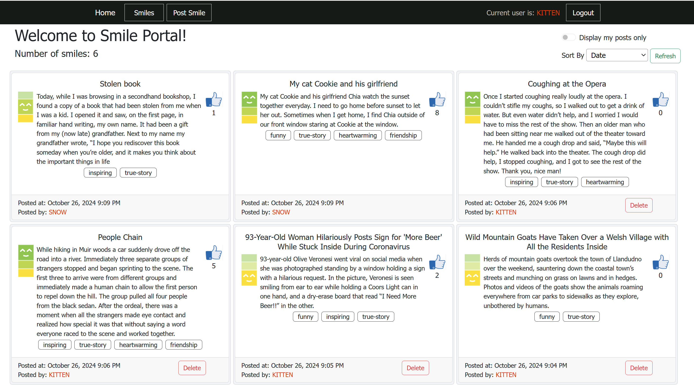
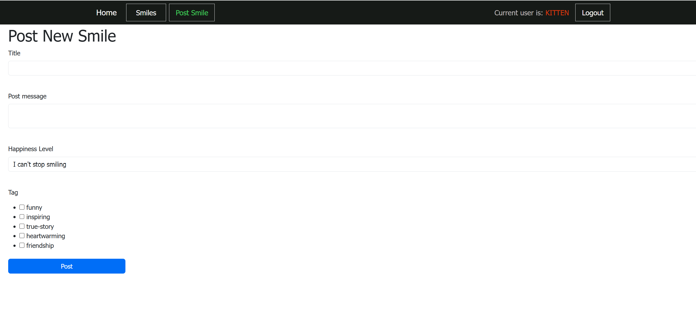
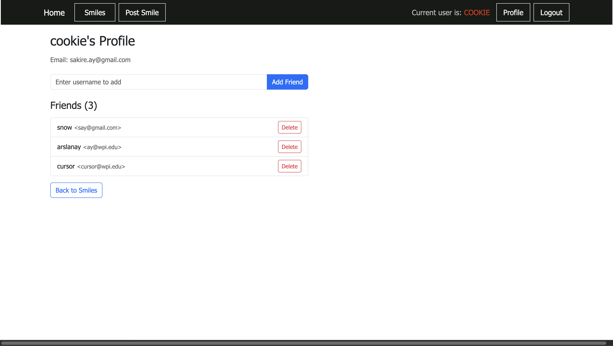
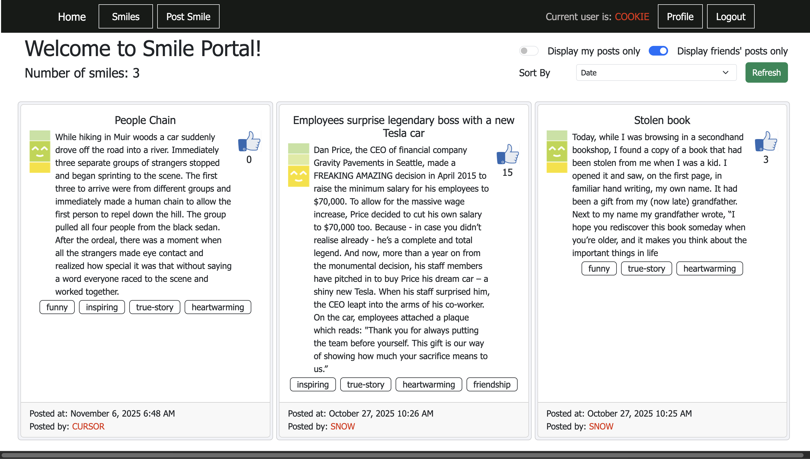

# Warmup Project - CS 3733 - 2026 C Term

# Milestone3

---

### Task 1: Get Started

---

In Milestone3,  you will start with your milestone-2 code and add additional features.

1. First, make sure your are checked out to `milestone2` branch ; run the following if you are not already.

   ```
   git checkout milestone2
   ```


   Create and checkout to a new branch called "milestone3".  The following commands will create a new branch "milestone3" and checkout to that branch.

   ```
   git branch milestone3
   git checkout milestone3
   ```
   Make sure your `milestone3` branch now has the latest milestone2 code. You will now be editing locally, and **remember to commit frequently**.


2. In milestone-3, you will have to make changes to the following files:

  * `main.css`
  * `base.html`
  * `index.html`
  * `register.html`
  * `login.html`
  * `auth_forms.py`
  * `models.py`
  * `auth_routes.py`

  The milestone-3 tasks will involve creating user profile, login, customizing view for the loged-in user, and deleting posts. We will include all registration/login/logout related routes and forms in `auth_routes.py` and `auth_forms.py` for better code organization and to improve code reuse. You can easily copy these files to your term project to add login/logout support. 

 --------

When you start milestone-3, the page should look like the following.

<kbd></kbd>

---

### Task 2:  Revise DB Model - Add `User` table

---
In the final version of our Smile app, only registered users will be able to view the smile posts and create new posts. We will store the registered "user" information in the `User` database model. 

1. In `models.py`, add a database model called `User`. The 'User' table will store the user's profile and login information. It should have the following attributes:

   |   | Field name | Description | Field type | Constraints | Comments |
   | :- | :-: | :-: | :-: | :-: | :-: |
   |  | id | auto generated id | integer | primary key | id of the User |
   |  | username | User's login username | string | max 64 chars, needs to be unique |  |
   |  | email | User's email address | string | max 120 chars, needs to be unique |  |
   |  | password_hash | User's login password | string | max 256 chars |  |

2. Define the following methods in `User` model. (See the `Student` model in StudentApp class exercise for examples.)

    * `__repr__` method : Prints user data. You should print the id and  username of each user.  See the `__repr__` methods in the StudentApp models.
    * `set_password`: Hashes a given password and sets it as the user's password. You should use Werkzeug `generate_password_hash` function to hash the password. 
    * `check_password` Verifies whether a given password matches the user's password.  You should use the Werkzeug `check_password_hash` function.

  - Make sure to import `generate_password_hash` and `check_password_hash` functions from `werkzeug.security` package. 
  

 3. Next we will apply the changes in the schema to the database file. Run the following commands to migrate the changes and update the database.
   
   ```
      flask db migrate -m "Adding User table."
      flask db upgrade
   ```
   
---
  <b>Important note:</b>  
  * If the above commands fail, or
  * If you previously deleted the database file `smile.py` and did not initialize `flask migration` repository, 
  
  go ahead and delete the database file and have the application re-create it. 
Remember that, in order to re-create the database with the new schema, you need to first delete the current database file `smile.db` and re-run the backend app. The decorator function `initDB` in `smile.py` will re-create the database file before the first request to the app.   

After the database is re-created, no smile posts will be displayed on the main page.

---

### Task 3: Register User

---

1. In `auth_forms.py`, add a new form class named `RegistrationForm`. We will use `RegistrationForm` to get the user's profile information.     

    * `RegistrationForm` should have the following attributes:

         * *username* : `StringField`, should not be empty, the username should not already exist in the `User` table. 
         * *email*: `StringField`, should not be empty, should have valid email syntax,  the email should not already exist in the `User` table. 
         * *two password fields*: `PasswordField`, both should not be empty, the password entered in both password fields should match.
         * *submit*:  `SubmitField` with label "Register".

    * Make sure to define all necessary form validators to enforce the constraints mentioned above. 
    * Don't forget to import `User` model in `forms.py`. You should also import `PasswordField` from `wtforms`.

2. In `register.html`, add a form template to render an instance of a `RegistrationForm`. (You will create the form instance in step-3 and pass it to `render_template`  when `register.html` is rendered. ) 
   
    * The form should display all form elements. When the user input is not valid, it should display the error messages from the validators. See the StudentApp `register.html` page for an example.  
   
3. In  `main.css`, define a CSS styling class element called `forminput` to style the form input fields. Specify appropriate width, margin, padding, and fort syling for the form inputs. Make sure to specify the width as a percentage. 

4. In `auth_routes.py` add a new route to the `auth` Blueprint for registering users. 

        * URL : '/user/register'
        * Methods: 'GET' and 'POST'
    
    * The starter code includes the decorator and function header for `register` view function. Make sure to update the path as `/user/register`.

    * The route decorator function should create a `RegistrationForm` instance and pass it to the `register.html` template for rendering. 

    * When the form is submitted it should create a new user, set the password, and add it to  the database. It should then issue an appropriate flash message and redirect to `main.index`. (**Note:** In task 4, we will change this and redirect to `auth.login`.)

    * Don't forget to import `RegistrationForm` from `app.auth.auth_forms`  and `User` from `app.main.models` in `auth_routes.py`.  

5. Open the URL `http://localhost:3000/user/register` in your browser, fill out the form, and submit.  

      * See the below image for an example styling of the registration form. 

      <kbd>  </kbd>

6. Make sure that the user is successfully registered by running SQLAlchemy query statements in the Python command line. 

      * First, add the `User` model to the shell context (, i.e., add the following to the dictionary that `make_shell_context` function returns) so that it is imported in the flask shell environment.

      ```
      'User': User
      ```

      * Then open flask shell and run the following SQLAlchemy commands. These will query the `User` table and print all registered users.  

    ```python
      > flask shell 
      >>> allUsers = db.session.scalars(sqla.select(User)).all()
      >>> for u in allUsers:
      >>>     print(u)
      ```
 

---

### Task 4: Login and Logout

---

In Task 4, we will add simple login and logout functionality to our Smile app. Below is a brief checklist of the changes you need to implement. You should refer to the Student App class exercise to see how we implemented login/logout using `flask-login`.

 1. Make the following edits in `app\__init__.py`. 
      * Import `flask-login`
     
     ```python
       from flask_login import LoginManager
     ```

      *  Create `LoginManager` object and configure the login view as `auth.login`
     ```
       login = LoginManager()
       login.login_view = 'auth.login'
     ```
      * In `create_app` function, configure the app object for login by calling ```login.init_app(app)```. See StudentApp application for an example. 


 2. In `models.py`, include the following imports. 
    ```python
      from flask_login import UserMixin
      from app import login
    ```
    Also, have the `User` model inherit from flask-login's `UserMixin` class. 

 3. Each time the logged-in user navigates to a new page, Flask-Login retrieves the ID of the user from the session, and then loads that user into memory. Because flask-login knows nothing about databases, the application needs to configure a user loader function called to load a user given the ID. 

    Add the following to `models.py`
      ```python
        @login.user_loader
        def load_user(id):
            return db.session.get(User, int(id))
      ```

 4. In `auth_forms.py`, add a new form class named `LoginForm`. 

    * `Login` should have the following attributes:
        * username : `StringField`, should not be empty.
        * password: `PasswordField`, should not be empty.
        * remember_me: `BooleanField`
        * submit:  `SubmitField` with label "Sign In".
    * Make sure to import `BooleanField` from `wtforms` in `auth_forms.py`
    
 5. In `login.html`, add template to render an instance of a `LoginForm`. (You will create the form instance in step-3 and pass it to `render_template` function when `login.html` is rendered. ) 
   
    * The form should display all form elements. When the user input is not valid, it should display the error messages from the validators. 
    * Style the form elements. 
    * In `login.html`, include a link to the `auth.register` route underneath the form. 


 6. In `auth_routes.py` add the `login` and `logout` routes to `bp_auth` Blueprint. See the StudentApp code for example route implementations. 

     * For `login`: 
       * Use `URL : '/user/login` and `methods: 'GET' and 'POST'`
       * If the user is already authenticated (logged-in), it should redirect to `main.index`. If not,  it should create an instance of `loginForm` and pass it to the `login.html` template for rendering. 
       * When the form is submitted, if the username and password match the user's credentials, it should login the user by calling `login_user` function of flask-login and redirect to `main.index`. Otherwise a `flash` message should be issued and the page should be redirected back to `auth.login`. 

     * For `logout`: 
        * Use `URL : '/user/logout` and `methods: 'GET'`
       * it should logout the user by calling `logout_user` function of flask-login and redirect to `main.index`. 

     * Don't forget to import following in `auth_routes.py`.  See the StudentApp implementation for examples. 
      * `current_user, login_user, logout_user, login_required`
      * `LoginForm`
      

 7. In `base.html`, add the URL links for `auth.login` and `auth.logout` . When the user is logged-in, the "Logout" link should be displayed, otherwise the "Login" link should be displayed. You need to include a conditional statement in your template to accomplish this. 

 8. In our app, we would like only the logged in users to see the smile posts. Therefore, all the routes, except `register` and `login`, should be protected from unauthorized users. 
    * Add the `@login_required` decorator to all routes in `routes.py` and `logout` route in `auth_routes.py` (i.e., all routes except `register` and `login`).
    * Make sure to import `current_user` and `login_required` from `flask_login` in `routes.py`. 

    * When you open the login page on the browser (i.e., `http://localhost:3000/login`, the page will look like the following:
    
    <kbd>  </kbd>

 9. In `base.html` display the username of the current user in the navigation bar. Username should be displayed only when the user is authenticated. 

 10. In `auth_routes.py`, in the `register` and `login` routes, check whether the current user is already authenticated. If so, the app should redirect to the index page (i.e., `main.index`). 

When you complete milestone2 , the main page will be similar to the following:

   <kbd>  </kbd>

---

### Task 5: Associate Posts with Users

---
In our app, we would like to keep track of which posts are posted by which users. To accomplish this, we need to associate the users with the posts they created. 

 1. In `models.py`, add a new integer column named `user_id` to the `Post` model. `user_id` should be a foreign key column referencing to the user's id (i.e., `user.id`).  See the `Course.major_id` column in StudentApp for an example.
  
    <i>Note:</i> Make sure that `User` class is defined before `Post` class.

 2. In `models.py`, add a new "many-to-one" relationship attribute named `posts` to the `User` model. The relationship should refer to the `Post` table and have a `back_populates` value "`writer`".  The `User.posts` relationship retrieves the posts for a given user and `writer` refers to the user for a given post.  See the `Major.courses` relationship in StudentApp application.

 3. Define a method called `get_user_posts` in the `User` class that returns the **list of posts** for the user. Remember that all methods of a class should have `self` as their first argument.

  --- 
  <b>Note</b> that in order to re-create the database with the new schema, you need to migrate schema changes and update the database file. Or you need to delete the database file `smile.db` and re-run the backend app.
  
  ---

 4. In `routes.py`, revise the `postsmile` route function. When you create a new post, initialize `user_id` with the `current_user`'s id. 

 5. Open the app, create a user account, login, and create couple posts. You can test whether these new posts are successfully associated with the logged in user by running some SQLAlchemy statements on the command line. Make sure that `User` class is included in the application context in `smile.py`:

  ```python
      > python 
      >>> flask shell
      >>> # get the user object having username 'kitten'. replace the username with the username of your user. 
      >>> user1 = db.session.scalars(sqla.select(User).where(User.username == 'kitten')).first()
      >>> # get the post object having title 'story1'. replace the title with the title you provided     
      >>> post1 = db.session.scalars(sqla.select(Post).where(Post.title == 'story1')).first()
      >>> # the following will print the posts of the user
      >>> for p in user1.get_user_posts():
      >>>     print(p)
      >>> # the following will retrieve the user who created the post    
      >>> post1.writer
      >>> # the following will print the username of the user who created the post  
      >>> print(post1.writer.username) 
  ```

 6. In `_post.html`, display the username of the user who created the post. 

   * Use the SQL alchemy command from Task 5.4 to get the username of  the post's writer. 
   * Enclose the `username` in a `<span>` element and apply appropriate CSS styling (for example you can apply  `useritem` CSS class selector). 
     <br><br>
   
------

When you open the index page on the browser (i.e., `http://localhost:3000`), the page will look like the following:


<kbd>  </kbd>
---

### Task 6: Displaying Current User's Posts

---

Now, we will add an option to our app for displaying current user's posts only. We will add a checkbox to the sort form; when checkbox is selected, only current user's posts will be displayed. Otherwise, all posts from all users will be displayed. 

1. In `forms.py`, add a new field of type `BooleanField` to `SortForm` (i.e., a checkbox). Apply an appropriate label for the `BooleanField` (for example, "Display my posts only.") Make sure to add the import for the `BooleanField`. 
2. In `index.html`, edit the sort form template and add the new checkbox field and it's label. (i.e., `BooleanField`)
2. In `routes.py`, in the `index` route view function, when the sort form is submitted (before you sort the posts) you should check the checkbox field data:  
    * if the checkbox is clicked (i.e, if the data of the `BooleanField` is `True`) you should filter by the results and return only current user's posts 
      * (Hint: `current_user.get_user_posts()` will return the list of all posts by the current user. I suggest you add another method in `User` model that will just return the relationship (i.e., `User.posts`). And in the `index` function, you need to write the SQL Alchemy query to get the posts of the user and apply `order_by` to further sort them.)

    * otherwise, you should get all posts in the Post table.  
  
  Make sure that stories are sorted according to the selected sort option when the user's own stories are displayed. 

   When you open the main page on the browser (i.e., `http://localhost:3000/`) and select the "Display my posts only!" checkbox,  the page will be similar to the following:.

  <kbd>  </kbd>

---

### Task 7: Deleting Posts

---

In our app, the logged-in user will be able to delete their own posts. 

 1. In `routes.py` add a new route for deleting users. Because the delete action causes changes in the application date, we will implement it as a 'POST' request.  

    * URL : `/post/<post_id>/delete`
    * Methods: 'POST'
    

    1. The route decorator function should query the `Post` table and get the post with id `post_id`. (Remember that `post_id` needs to be passed to the decorator function as argument) 
    2. If the post is found, it should remove the post and all its tags. 
        * In `models.py`, set the `passive_deletes` property of the `Post.tags` relationship to `True` (i.e., add `passive_deletes=True` to `tags` relationship). 
        * In a `for` loop iterate over all tags of the post and remove them:
            * `thepost.tags.remove(t)` where `thepost` is the post that will be deleted and `t` is a tag that needs to be deleted.
        * You should commit after you remove the tags of the post. You will get a SQLAlchemy error if you fail to commit.   
        * Delete the post and commit. (Hint: `db.session.delete(thepost)`)
    4. You can issue flash messages when the post is succesfully deleted. 
    5. After the post is deleted, the page should be redirected to `main.index`'.

 2. Add a delete button to the users posts. In `_post.html`, add an HTML form element below the "number of likes". The template of the form is given below. Set the `action` of this form  (i.e., `###`) to the URL of the delete route. (Hint: use `url_for`)
    ```html
    <form action="###" method="post">
      <input type="submit" value="Delete" >
    </form>
    ```
     For simplicity, here we issue the `delete` POST request in a basic HTML form element. You may alternatively create a simple wt-form element in the `main.index` route and render it here. (Similar to the `EmptyForm`  in the Student App class example). 
  

     To style the "Delete" button, you can apply the `button` CSS selector for the submit input element. 

 3. You should display the "Delete" button **only for the posts of the current user**, i.e., when the post's writer (`post.writer`) is the current user. Other posts should not display the "Delete" button. 


    When you complete Task-7, the index page will look like the following: 

  <kbd>  </kbd>

---

### Task 8: Formatting timestamps

---

We will format the UTC timestamps using `flask-moment`. See the Student App wrmup for examples. 

 1. Make the following edits in `app\__init__.py`. 
   * Import `flask-moment`
      ```python
        from flask_moment import Moment
      ```

   *  Create `Moment` object.  
      ```python
        moment = Moment()
      ```
   * In `create_app` function, configure the app object for `Moment` by calling ```moment.init_app(app)```. 
      ```python
        moment.init_app(app)
      ```

 2. In `base.html`, include the following within the `<head>` element.  
      ```python
        {{ moment.include_moment() }}
      ```

 3. Style the post timestamps by applying the `moment` object's `format` function. For example:
    ```python
      moment(post.timestamp).format('LLL')
    ```

    Choose an appropriate timestamp format. See [https://blog.miguelgrinberg.com/post/the-flask-mega-tutorial-part-xii-dates-and-times](https://blog.miguelgrinberg.com/post/the-flask-mega-tutorial-part-xii-dates-and-times) for different format options. 

-----

When you complete Task-8 , the main page will be similar to the following:

<kbd>  </kbd>

---

### Task 9: Revising the "like" use case

---

In milestone-1 Task-5, we implemented the "like" use case. When the "like" button was clicked, we issued a POST request to the `main.like` route, which incremented the like count of the post and redirected to the index page to reload with the updated content. In milestone-2, when we added the "sort" use case, we had some unexpected side effects of the redirect: Whenever we liked a story, the sort order was reset to the default sort order. 

In this task, we will revise our "like" usecase implemention and we will update the likecount on the index page without a re-load. 

 1. First we will revise the `like` view function and have it return the updated post count in a JSON object. 
    * In `routes.py` , delete the redirect call to `main.index` route.  
    * After the count of the post is incremented and  updated in the database, re-read the `Post` object from the database to get the updated object.
    * Return a JSON object that includes `post_id` and the updated like count of the post. (Hint: You can include the `post_id` and likecount in a Python dictionary and call `jsonify`)
    * Add  `GET` to the methods of the like route. 

2. Test your revised route by typing the following URL in the browser. Replace `<post_id>` with the id of a post that exists in your database. 

    `http://localhost:3000/post/<post_id>/like `

    If the request is successful, you should see the JSON output with the updated count. For example, assuming `post_id` is 7: 
    ```json
    {
    "like_count": 2,
    "post_id": 7
    }
    ```
  3. We will next write couple JavaScript functions to update the like count of the post with the updated value. 
    * In `_post.html` add a script block at the end of the page.

  ```JavaScript  
      
      <script>
         // your JavaScript code 
      </script>    
     
  ```

  * Define an asynchronous JavaScript function called `like_post` which will take the `post_id` and issue a request to the `main.like` route  (see the `get_roster` function in StudentApp. ) You should first get the URL of the route by calling `url_for`, and than issue the request using JavaScript `fetch` function.  The response received from the request should be passed to the `update_likes` function defined in the next step. 
  * Define a JavaScript function called `update_likes` that will take the JSON data received from the request and update content of the HTTP element which displays the like count of the "liked" post. 
      * The given starter code uses a HTML table to render a story's (post's) data. Each of the "post" tables is assigned a unique id having the following format (see the first line of `_post.html`): 
      
        `post-<post_id>`  where `post_id` is the id of the post displayed in the table.

      * In the `update_likes` function retrieve the HTML element having the id `post-<post_id>` (i.e., the table that displays that post's data).
      * Then, find the div element in that table having the class selector `.likecount`.  This is the element having the likecount content. 
      * Update the `textContent` of that div element with the "likecount" value recieved in JSON data. 
    * Don't forget to call the `update_likes` function in  `like_post` and pass the received JSON response.

  4. In milestone1, we added a `form` element to `_post.html` for submitting the post request to `main.like` route for liking a post. We now will handle this using our JavaScript function. 
  * Remove the HTML form element for the "like" button, and add an HTML `button` element. 
  * When clicked, your `like_post` JavaScript function should be called and `post`s id should be passed to it. For an example, see the button we added to display class rosters in StudentApp.
  * Don't forget to apply the `likebtn` styling to this button.  
  
  5. Open the frontend and try liking some stories. Make sure that the likecount for the post is updated correctly without a page refresh. 

---

### Task 10: Style with Bootstrap

---

Improve the style of your application using Bootstrap styling. You can repeat the steps from the StudentApp v.10. 

The following were the templates we used in StudentsApp for the navigation bar and the wt-forms rendering. 
  * Navigation bar: https://github.com/WPI-CS3733-2025B/StudentApp-starter/blob/main/app/templates/bootstrap_base.html 
  * WTF forms: https://github.com/WPI-CS3733-2025B/studentapp-starter/blob/main/app/templates/bootstrap_wtf.html 

You **should style** the following using Bootstrap in your pages:

  * Navigation bar (`base.html`)
  * Create post form (`create.html`)
  * Register and login forms (`register.html` and `login.html`)
  * Sort form (`index.html`)

Styling of the following using Bootstrap is recommended :
  * The post stories themselves (`_post.html`)
    * In my implementation, I used the `card` Bootstrap styling for the posts. Instead of a HTML `<table>`, I included each post in a `<div>` element styled as `card` and organized the parts of the post story (i.e., title, body, timestap, likecount, writer user, etc.) using Bootstrap grid styling. 


Below is the index page styled using Bootstrap. 
  <kbd>  </kbd>

Below is the "Post New Smile" page styled using Bootstrap. 
  <kbd>  </kbd>

---

### Task 11: Generative AI Exercise: Connecting with Friends and Viewing Their Posts [Extra Credit]

---
Use a Generative AI tool (e.g. Cursor, GitHub Copilot) to implement the following. Please note that you are allowed to use Generative AI only for this task (Task 11) of your assignment. All other prts should be your own code. 
1. Update the database model to define a self-referential relationship in the User entity to represent friendships. This relationship does not need to store any additional details about the friendship—it should simply record who is friends with whom.

2. Add a form to the profile page that allows users to enter a friend’s username and add them as a friend.
 * If the entered username does not match any user in the database, display a flash message indicating that the user does not exist.
 * If the entered username belongs to someone who is already a friend, display a flash message indicating that the user is already a friend.
 * A user should not be able to add themselves as a friend.

3. Add delete option for removing a friend. 

See below for an example profile page:

<kbd>  </kbd>

4. On the index page, add a new checkbox to the `SortForm` for displaying the friends' posts only. When selected, you app should filter the posts and only display the posts by the user's friends.

See below for an example:

<kbd>  </kbd>
---

### Task 12: Deploying to AWS Cloud [Extra Credit]

---

Follow the instructions in the [AWS Setup Guide](./AWSSetupGuide/awsSetup.md). Special thanks to Vivek Jagadeesh for creating this document.  

Here is a video where Vivek walks you through (part of) these instructions. 
* [Walkthrough of AWS Deployment](https://echo360.org/media/9635be0e-0308-4203-9036-e3d9048bd277/public)

And here is the accompanying set of slides. 
* [Deploying an app to AWS EC2 & RDS](./AWSSetupGuide/AWS%20Cloud%20Deployment%20-%20Google%20Slides.pdf)

To submit Task11: 
<b> Edit the `README.md` file and add your AWS deployment link to the top of the file.</b>  

---

### Run automated tests

---

Run the provided automated tests under `/tests` directory:
  * `test_models.py` includes unit tests for the model. These tests use the `unittest`  testing framework.
    To run them run the following command on the terminal. 
       * ```python -m unittest -v tests/test_models.py```

  * `test_routes.py` includes functional tests , testing the major routes of the app. These test use `pytest` framework.

    * In `routes.py` update the `assert` statements according to you own implementation. For example, on line #129, we are checking for the expected page content after login and we expect the text `"Welcome to Smile Portal!"` on the page. Change the expected content according to your own implementation. 
    I included the below comment before each of the `assert` statements that you should revise. Search for this comment in the file. 
    ```python
      #Students should update this assertion condition according to their own page content
    ```

    To run these tests run the following command on the terminal. 
       * ```pytest -v tests/test_routes.py```

  In your term project, you will write tests similar to these. 


---
### How to Submit
---
1. Make sure that you have the screenshot of the DataGrip that shows your `Post` table content of your PostgreSQL database in your work directory (`StudentApp` folder). 

    If you deployed your application on AWS, make sure that you added your deployment link to the `README.md` file in milestone3 branch. 

2. Commit and push to GitHub

   *  Make sure you are in branch `milestone3`, and check the commit status. 
       ```
       git checkout milestone3
       git status
       ```
   * Add and commit your changes locally. Make sure you are in branch `milestone3`. 
       ```
       git add <list all new and changed files here; seperate filenames with space.>   (or  git add .)
       git commit -am "Your own commit message"
       ```

   * Push the `milestone3` branch to your remote GitHub repo:
       ```
       git push origin milestone3
       ```
       - You can commit multiple times. Please make sure not to make any commits to `milestone3` branch after the milestone3 deadline. 

    * Open your SmileApp repo on GitHub and **create a "pull request"** to merge the commits in milestone3 branch to the main. Review the merge, resolve any  merge conflicts if there is any, and complete the merge. 
  

3. Submit your repo link on Canvas

   * Copy your repository URL and submit it in the Canvas `Milestone3` dropbox. 
 

